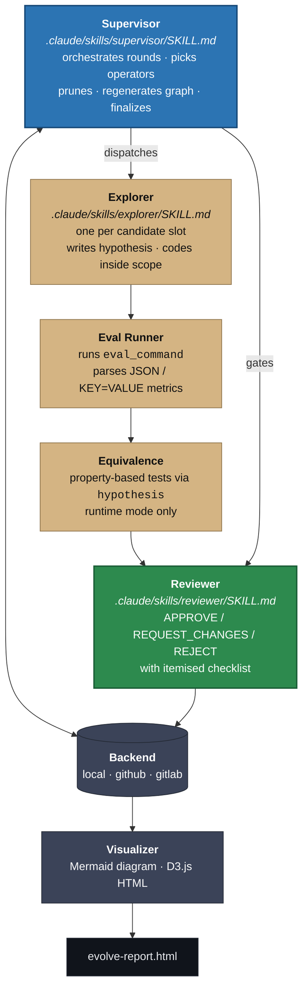
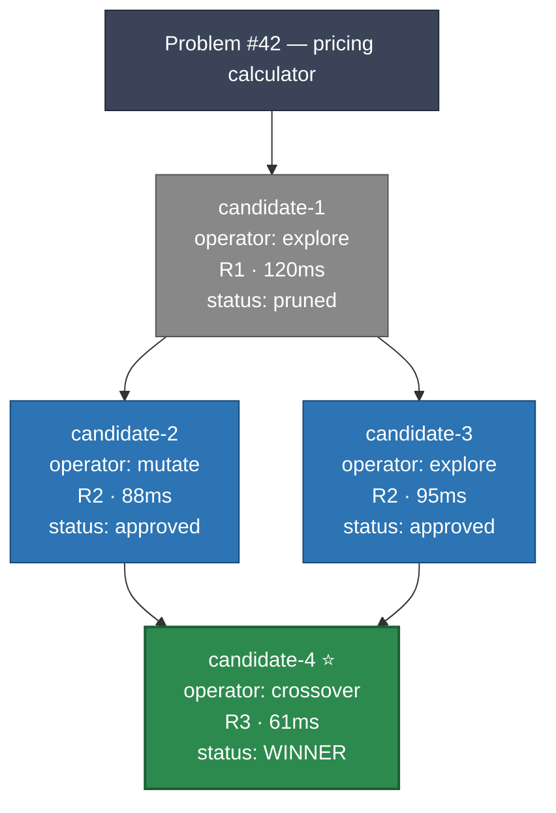

# agent-evolve

Platform-agnostic evolutionary optimization for codebases. AI agents cooperate
to iteratively explore and evolve better solutions to a defined problem —
improving correctness, runtime, or clarity — under strict human-approval gates.

Inspired by [`gh-evolve`](https://github.com/kaiwong-sapiens/gh-evolve), extended
with a platform-agnostic backend, module-scoped runs, supervisor + reviewer
orchestration, a runtime-optimization mode with property-based equivalence
checking, and an interactive D3.js evolution graph.

## Highlights

- **Platform-agnostic backend.** Local filesystem, GitHub (Issues + PRs),
  GitLab (Issues + MRs). A single abstract `EvolveBackend` interface; the
  supervisor doesn't know or care which one it is talking to.
- **Module-scoped runs.** Each evolution targets a specific file or directory;
  the scope enforcer rejects any candidate whose diff strays outside
  `target_files` or touches `do_not_touch`.
- **Supervisor + explorer + reviewer agents.** Three `SKILL.md` files define
  the protocol. The reviewer is the last gate: APPROVE / REQUEST_CHANGES /
  REJECT with an itemised checklist.
- **Runtime mode with logic equivalence.** Property-based testing via
  `hypothesis` — hundreds of random inputs through both the original and the
  optimised function; no claimed speedup is accepted without proof of
  equivalence.
- **Human approval gate.** Agents are architecturally forbidden from merging.
  `agents_can_merge` is `False` on the abstract base class; `__init_subclass__`
  raises `TypeError` if a subclass tries to override it. The final PR is
  opened against `main` but **left open**.
- **Visual evolution graph.** Mermaid diagrams embedded in Issues for native
  GitHub rendering, plus a standalone interactive D3.js HTML report with
  lineage and timeline views.

## Install

```bash
uv sync --extra dev
```

Requires Python 3.12+.

## Quickstart

A 60-second walkthrough using the local backend — no GitHub token needed.

### 1. Drop a manifest next to the code you want to evolve

```bash
cp examples/agent-evolve.yaml my-project/agent-evolve.yaml
# edit target_files, metrics, and eval_command for your codebase
```

### 2. Validate the manifest

```bash
uv run agent-evolve validate my-project/agent-evolve.yaml
# ok — 'Optimise the order pricing calculator' (runtime mode, backend=local)
```

### 3. Drive a run from Python

The supervisor agent normally drives this via tool calls, but everything is
plain Python — you can orchestrate a run yourself:

```python
from agent_evolve.config import load_manifest
from agent_evolve.backends import LocalBackend
from agent_evolve.models import Candidate, ReviewerVerdict
from agent_evolve.scope import enforce_scope
from agent_evolve.eval import run_eval
from agent_evolve.viz import build_graph, render_mermaid, render_html

spec = load_manifest("my-project/agent-evolve.yaml")
backend = LocalBackend(spec, root="evolve-state")
problem_id = backend.create_problem(spec)

# Round 1 — baseline
candidate = Candidate(
    problem_id=problem_id, candidate_id="1",
    operator="explore", round=1,
    hypothesis="Baseline implementation.",
)
backend.submit_candidate(candidate)

# Before scoring, check scope
diff = ["src/pricing/calculator.py"]
report = enforce_scope(diff, spec.scope)
assert report.in_scope, report.violations

# Run the eval command and record metrics
result = run_eval(spec.eval_command)
backend.score_candidate("1", result.metrics)

# Reviewer verdict (structured — one per candidate)
backend.record_verdict("1", ReviewerVerdict(
    verdict="APPROVE",
    reason="Meets hard constraints, no scope violations.",
    checklist={"scope_compliant": True, "metrics_improved": True},
    confidence="high",
))

# Regenerate the graph + HTML report after each round
graph = build_graph(backend.get_leaderboard(), problem_id=problem_id)
backend.update_graph(render_mermaid(graph), "evolve-report.html")
render_html(graph, "evolve-report.html")

# When a round-based winner emerges, finalize — opens a "PR" (never merges)
pr_path = backend.finalize("1")
print(f"Final PR descriptor at: {pr_path}")
```

### 4. Open the report

```bash
# Open the interactive search tree in your browser
start evolve-report.html      # Windows
xdg-open evolve-report.html   # Linux
open evolve-report.html       # macOS
```

Click any node to inspect its hypothesis, conclusion, metrics, and
reviewer verdict. Toggle **Timeline** to see the tree laid out by round;
**Export PNG** for a static copy.

## Using the GitHub backend

Switch the manifest's `backend.type` to `github` and set `backend.repo`:

```yaml
backend:
  type: github
  repo: kyleyhw/my-project
```

Set a token with `repo` scope:

```bash
export GH_TOKEN=ghp_xxxxxxxxxxxxxxxx
```

Then use `GitHubBackend` in place of `LocalBackend`:

```python
from agent_evolve.backends import GitHubBackend
backend = GitHubBackend(spec)
```

`create_problem()` opens an Issue and installs a branch protection rule on
`main`. Candidates become draft PRs with an `EVOLVE_STATE` JSON block embedded
in their bodies. The supervisor's `finalize()` opens a non-draft PR from the
winner's branch against `main` and **stops** — a human reviewer merges.

## Using the supervisor / explorer / reviewer skills

The three skills in `.claude/skills/*/SKILL.md` are the canonical drivers.
They are plain Markdown files with YAML frontmatter — any agent runner that
speaks the Claude-Code skills convention picks them up automatically.

### Registration (Claude Code)

Claude Code discovers skills by directory layout alone — no configuration
required. The repo already has the right shape:

```
agent-evolve/
└── .claude/
    └── skills/
        ├── supervisor/SKILL.md   →  /supervisor
        ├── explorer/SKILL.md     →  /explorer
        └── reviewer/SKILL.md     →  /reviewer
```

When Claude Code is started inside the repo, the three skills become
available as slash commands. Claude can also auto-invoke them when the
conversation matches the skill's `description` / `when_to_use` frontmatter.

To make the skills available globally (any project), symlink or copy the
directories under `~/.claude/skills/` instead.

### Typical orchestration

1. User runs `/supervisor examples/agent-evolve.yaml` (or any manifest path).
2. The supervisor reads the Trait Matrix, chooses operators for the round,
   and spawns one explorer per slot — either by invoking `/explorer` in turn
   or by calling the `Agent` tool for parallel subagent execution.
3. Each explorer produces a candidate on branch `evolve/<problem>/candidate-<n>`.
4. The supervisor runs the eval + equivalence pipeline, then calls `/reviewer`
   for each scored candidate and records the verdict via `backend.record_verdict`.
5. After the final round, the supervisor calls `backend.finalize(winner)` and
   reports the PR URL. A human merges.

See [`docs/skills.md`](docs/skills.md) for the full invocation guide — custom
runners, frontmatter reference, and how to swap the skills for your own.

The skills only ever touch the backend through its public interface, so you
can swap `LocalBackend` for `GitHubBackend` or `GitLabBackend` without
changing any prompts.

## Example manifest

A minimal `agent-evolve.yaml` lives alongside the code you want to evolve:

```yaml
problem:
  description: "Optimise the order pricing calculator"
  mode: runtime
  eval_command: "pytest tests/pricing/ --benchmark-json=benchmark.json"
  metrics:
    - {name: duration_ms, optimise: minimize}
    - {name: test_pass_rate, optimise: maximize, minimum: 1.0}

scope:
  target_files: [src/pricing/calculator.py, src/pricing/utils.py]
  do_not_touch: [src/auth/, src/pricing/models.py]

backend:
  type: github
  repo: your-org/your-repo
```

See [`examples/agent-evolve.yaml`](examples/agent-evolve.yaml) for the full
schema with every option documented.

## How it works



Every round:

1. Supervisor reads the Trait Matrix.
2. Picks one of `mutate` / `crossover` / `explore` for each of
   `candidates_per_round` slots.
3. Explorers produce candidates on `evolve/<problem>/candidate-<n>` branches.
4. Each candidate runs through the eval runner, the scope enforcer, and (in
   runtime mode) the equivalence checker.
5. The reviewer gates every scored candidate.
6. Pareto-inferior candidates are pruned.
7. The Mermaid graph + HTML report are regenerated and attached to the
   problem root.

After the last round, the supervisor calls `backend.finalize(winner_id)` —
closing losers, opening the final PR, and stopping. A human merges.

### Example: 4-candidate run over 3 rounds

A snapshot of the Mermaid graph that the supervisor attaches to the problem
Issue after each round (regenerated from [`examples/evolve-graph.mmd`](examples/evolve-graph.mmd)):



The same data renders as an interactive D3 tree in
[`examples/evolve-report.html`](examples/evolve-report.html) with click-through
inspectors, a timeline view, and PNG export.

### End-to-end demo

[`examples/demo_run.py`](examples/demo_run.py) drives the full pipeline
without agents — hardcoded candidate variants of `fib(n)` (naive recursive →
memoised → buggy forward-loop → correct iterative) flow through the real
eval runner, scope enforcer, equivalence checker, reviewer, and visualiser.

```bash
uv run python examples/demo_run.py
```

Expected output (four candidates across three rounds; the buggy one is
rejected when the equivalence checker finds `fib(0)` returning `1` instead
of `0`):

```
  #1  R1 explore    2598.02µs   REQUEST_CHANGES
  #2  R2 mutate        0.10µs   APPROVE          ← winner
  #3  R2 mutate        0.56µs   REJECT           (non-equivalent)
  #4  R3 crossover     0.58µs   APPROVE
```

The demo also writes [`examples/demo-report.html`](examples/demo-report.html)
— the D3 report for this exact run.

## CLI

```bash
# Validate a manifest
uv run agent-evolve validate examples/agent-evolve.yaml

# Rebuild the HTML report from an existing run's state
uv run agent-evolve report evolve-state/1 --output evolve-report.html
```

## Safety invariants

The `EvolveBackend` base class enforces these at class-creation time:

- `agents_can_merge` is hardcoded `False`. Subclasses redefining it raise
  `TypeError` before they can be instantiated.
- `assert_no_merge(action)` is called at the top of every `finalize()`
  implementation. It raises `MergeNotPermittedError` if the flag were ever
  flipped.
- `finalize()` opens a PR; it never merges. Closing losers, yes. Merging the
  winner, no — that's a human's job.

The GitHub backend additionally installs a branch protection rule on the
protected branch during `create_problem()`.

## Running the tests

```bash
uv run pytest -q
```

The suite covers scope enforcement, the local backend, merge-safety
invariants, the equivalence checker (including divergent exception
behaviour), the eval runner's JSON + KV parsing, and the visualization
pipeline.

## Project structure

```
src/agent_evolve/
    backends/     base.py  local.py  github.py  gitlab.py
    eval/         runner.py  equivalence.py
    sandbox/      docker_runner.py
    scope/        enforcer.py
    viz/          graph.py  mermaid.py  html_report.py
    models.py     config.py  cli.py
.claude/skills/                 ← auto-discovered by Claude Code
    supervisor/SKILL.md
    explorer/SKILL.md
    reviewer/SKILL.md
docs/
    skills.md                   ← registration + invocation guide
examples/
    agent-evolve.yaml
    evolve-graph.mmd            ← sample Mermaid output
    evolve-report.html          ← sample interactive D3 report
    demo_run.py                 ← end-to-end pipeline demo
    demo-report.html            ← report generated by demo_run.py
tests/
    test_backends.py  test_equivalence.py  test_eval_runner.py
    test_scope.py     test_viz.py          test_config.py
```

## References

- [`gh-evolve`](https://github.com/kaiwong-sapiens/gh-evolve) — original
  inspiration; this project extends its protocol with a platform-agnostic
  backend and supervisor/reviewer agents
- [AlphaEvolve](https://deepmind.google/discover/blog/alphaevolve-a-gemini-powered-coding-agent-for-designing-advanced-algorithms/)
  — the academic inspiration for evolutionary code search
- [`hypothesis`](https://hypothesis.readthedocs.io/) — property-based testing
  powering the equivalence checker
