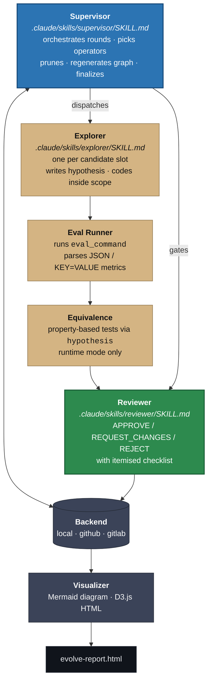
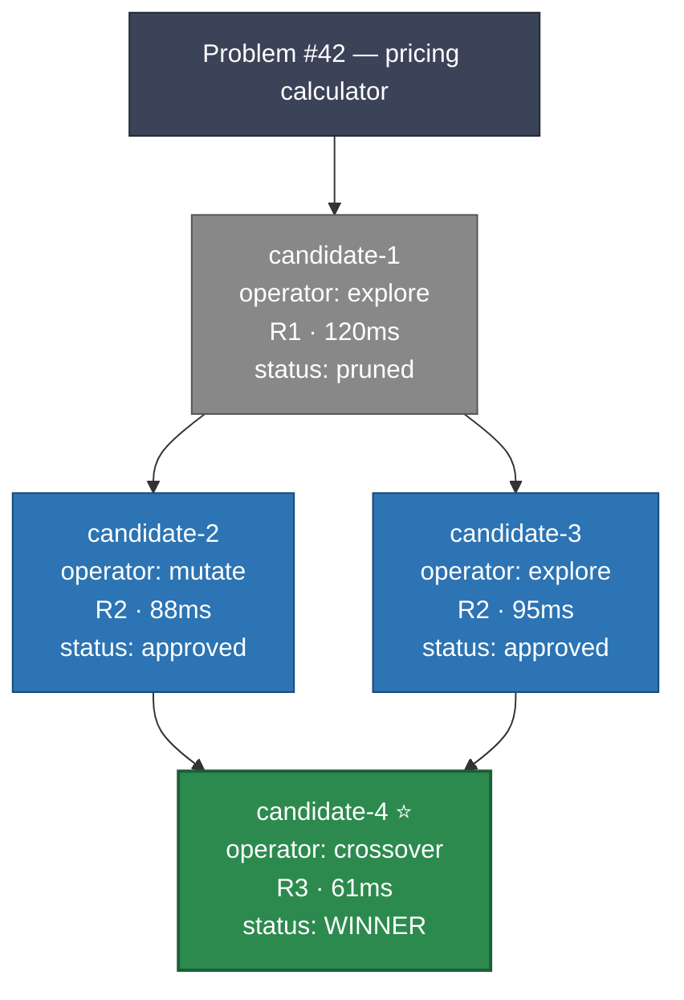

# agent-evolve

> **Read this as instructions you give to Claude, not as commands you run
> yourself.** agent-evolve is an AI-driven tool — Claude is the one that
> runs the supervisor / explorer / reviewer skills, calls the Python
> tooling, opens branches, and produces the final PR. You, the human, drive
> it by telling Claude what to optimise and then reviewing the PR Claude
> leaves open for you.

An evolutionary search system for codebases using cooperating language-model
agents on isolated git branches. Written with the goal of producing
performance, correctness, or clarity improvements surfaced as pull requests
for human approval.

Inspired by [`gh-evolve`](https://github.com/kaiwong-sapiens/gh-evolve),
extended with a platform-agnostic backend, module-scoped runs, supervisor +
reviewer orchestration, a runtime-optimization mode with property-based
equivalence checking, and an interactive D3.js evolution graph.

## Highlights

- **Claude drives everything.** The three `SKILL.md` files under
  `.claude/skills/` define the protocol; Claude Code auto-discovers them
  and exposes them as `/supervisor`, `/explorer`, `/reviewer`. You tell
  Claude to optimise something; Claude runs the loop.
- **Platform-agnostic backend.** Local filesystem, GitHub (Issues + PRs),
  GitLab (Issues + MRs). A single abstract `EvolveBackend` interface; the
  supervisor doesn't know or care which one it is talking to.
- **Module-scoped runs.** Each evolution targets a specific file or directory;
  the scope enforcer rejects any candidate whose diff strays outside
  `target_files` or touches `do_not_touch`.
- **Runtime mode with logic equivalence.** Property-based testing via
  `hypothesis` — hundreds of random inputs through both the original and the
  optimised function; no claimed speedup is accepted without proof of
  equivalence.
- **Human approval gate.** Agents are architecturally forbidden from merging.
  `agents_can_merge` is `False` on the abstract base class; `__init_subclass__`
  raises `TypeError` if a subclass tries to override it. The final PR is
  opened against `main` but **left open** — Claude never merges, by
  construction.
- **Visual evolution graph.** Mermaid diagrams embedded in Issues for native
  GitHub rendering, plus a standalone interactive D3.js HTML report with
  lineage and timeline views.

## Quickstart — what to tell Claude

### 1. Open the repo in Claude Code

No install step for the skills — Claude Code auto-discovers every
`SKILL.md` under `.claude/skills/`. Confirm with:

```
/supervisor   <Tab>
```

If `/supervisor`, `/explorer`, `/reviewer` are not offered, tell Claude:

> "The skills under `.claude/skills/` are not showing up as slash commands.
>  Diagnose and fix."

### 2. Install the Python dependencies

Tell Claude:

> "Install the project dependencies with uv."

Claude runs `uv sync --extra dev`. (Requires Python 3.12+.)

### 3. Write the manifest

Either edit `examples/agent-evolve.yaml` by hand, or delegate:

> "Create an `agent-evolve.yaml` for optimising `src/pricing/calculator.py`.
>  Metrics: `duration_ms` minimize and `test_pass_rate` maximize with
>  `minimum: 1.0`. Eval command: `pytest tests/pricing/`."

Claude will write the manifest using the example as a template.

### 4. Tell Claude to start the evolution

Slash-command form:

```
/supervisor my-project/agent-evolve.yaml
```

Natural-language form — Claude will choose `/supervisor` from the skill's
`description`:

> "Run the evolutionary search on `src/pricing/calculator.py`. Honour the
>  manifest at `my-project/agent-evolve.yaml`."

Claude then reads [`.claude/skills/supervisor/SKILL.md`](.claude/skills/supervisor/SKILL.md)
and drives the loop — spawning `/explorer` subagents for each candidate
slot (in parallel via the `Agent` tool), running eval + scope + equivalence
on every candidate, invoking `/reviewer` for each scored candidate, and
regenerating the Mermaid + HTML evolution graph after every round.

### 5. Review the final PR

Claude leaves the winning PR open against `main`. Read the evolution graph,
the reviewer verdict, and the diff, then merge manually. Claude will not
merge — that invariant is enforced by the Python layer, not by policy.

> "Summarise the evolution run for me. What did each operator try, and why
>  did the winner beat its parents?"

is a reasonable follow-up to ask Claude before you hit merge.

## What the skills are good at

Four concrete things Claude can do with the three skills. Each is just a
different shape of manifest — the same supervisor / explorer / reviewer
machinery drives all of them.

### 1. Runtime optimization — "make this faster without changing behaviour"

When you need a function to be fast and the current behaviour is
authoritative. Claude explores memoisation, vectorisation, smarter data
structures, algorithmic rewrites — and the equivalence checker rejects any
candidate that disagrees with the baseline on 500 random inputs.

> "Optimise `src/pricing/calculator.py` for runtime. Treat the current
>  behaviour as authoritative — any candidate that fails the equivalence
>  check at 500 samples is rejected."

```yaml
problem:
  mode: runtime
  eval_command: "pytest tests/pricing/ --benchmark-json=out.json"
  metrics:
    - {name: duration_ms,     optimise: minimize}
    - {name: test_pass_rate,  optimise: maximize, minimum: 1.0}
runtime_mode:
  equivalence_check: required
  property_test_samples: 500
```

This is the shape of [`examples/demo_run.py`](examples/demo_run.py) — see
the naive-recursive → memoised → iterative Fibonacci walkthrough further
down.

### 2. Statistical / metric optimization — "maximize Sharpe, minimize drawdown"

When behaviour *should* change and the goal is a better number. Trading
strategies, hyperparameter search, heuristic tuning, any scenario where
"the right answer" is defined by a benchmark and not by a reference
implementation.

> "Evolve `src/strategies/momentum.py` to maximize Sharpe ratio and
>  minimize max drawdown on the 2020-2024 backtest. Keep win rate above
>  40% as a hard constraint. Don't touch `src/strategies/risk.py`."

```yaml
problem:
  mode: algorithm                 # equivalence check disabled by default
  eval_command: "python scripts/backtest.py --years 2020-2024"
  metrics:
    - {name: sharpe,        optimise: maximize}
    - {name: max_drawdown,  optimise: minimize}
    - {name: win_rate,      optimise: maximize, minimum: 0.4}
evolution:
  operators: [mutate, crossover, explore]
  prune_strategy: pareto          # Pareto-front across the three metrics
```

This is the canonical [`gh-evolve`](https://github.com/kaiwong-sapiens/gh-evolve)
use case and what the Pareto pruning strategy was built for.

### 3. Algorithm correctness — "make the failing tests pass"

When a test suite is red and you want Claude to iterate until it's green.
The reviewer checklist's hard constraint (`test_pass_rate minimum: 1.0`)
rejects any candidate that doesn't hit 100%.

> "`src/graphs/dijkstra.py` is failing three tests in `tests/graphs/`. Run
>  the evolutionary loop with `test_pass_rate` as the only metric
>  (minimum 1.0). Don't modify tests or anything outside `src/graphs/`."

```yaml
problem:
  mode: algorithm
  eval_command: "pytest tests/graphs/ --tb=short"
  metrics:
    - {name: test_pass_rate, optimise: maximize, minimum: 1.0}
scope:
  target_files: [src/graphs/]
  do_not_touch: [tests/]          # can't pass tests by deleting them
evolution:
  rounds: 8                       # more rounds — correctness search is wider
  candidates_per_round: 3
```

The `do_not_touch: [tests/]` line is the critical one — it prevents the
scope enforcer from accepting the classic "I fixed the tests by deleting
the assertions" failure mode.

### 4. Clarity refactor — "keep the behaviour, cut the complexity"

When the code works but is unreadable. Runtime mode preserves behaviour;
the metric is some complexity measure. Claude mutates toward simpler
control flow, shorter functions, fewer nested conditionals — and the
equivalence check stops it from "simplifying" by breaking behaviour.

> "Refactor `src/billing/invoice_processor.py` for readability. Treat the
>  current behaviour as authoritative. Optimise for cyclomatic complexity
>  via radon, and keep all existing tests passing."

```yaml
problem:
  mode: runtime
  eval_command: "pytest tests/billing/ && radon cc src/billing/invoice_processor.py -a --json"
  metrics:
    - {name: average_complexity, optimise: minimize}
    - {name: test_pass_rate,     optimise: maximize, minimum: 1.0}
runtime_mode:
  equivalence_check: required
```

This one reads a complexity number out of `radon` — any eval command that
emits numeric metrics on stdout (JSON object or `KEY=VALUE` lines) works.

---

These four are not a fixed menu — they are just different manifests. You
describe the problem to Claude; Claude writes (or asks you to confirm) a
manifest in one of these shapes, then drives the loop.

## Using the GitHub backend

Tell Claude to switch:

> "Change the manifest's `backend.type` to `github` with `repo:
>  kyleyhw/my-project`, and set `GH_TOKEN` from my `.env`."

Claude will update the YAML and confirm the token is readable. With the
GitHub backend selected, `create_problem()` opens an evolutionary Issue and
installs a branch protection rule on `main`; candidates become draft PRs
with an `EVOLVE_STATE` JSON block embedded in their bodies; `finalize()`
opens a non-draft PR from the winner's branch against `main` and **stops**
— a human reviewer merges.

The token needs `repo` scope. You can supply it via `GH_TOKEN` or
`GITHUB_TOKEN` in the environment, or pass it to `GitHubBackend(..., github_token=...)`
explicitly if Claude is constructing the backend directly.

## The three skills

The skills are the canonical drivers — everything else (Python, CLI, the
demo script) is scaffolding so Claude has something concrete to call.

| Skill | Slash command | What Claude does when invoked |
|---|---|---|
| `supervisor` | `/supervisor <manifest>` | Reads the manifest, drives rounds, picks operators, gates with reviewer, opens the final PR. Never merges. |
| `explorer` | `/explorer <candidate-id> <operator> <parents>` | Produces one candidate — writes hypothesis, codes inside scope, commits to `evolve/<problem>/candidate-<n>`. |
| `reviewer` | `/reviewer <candidate-id>` | APPROVE / REQUEST_CHANGES / REJECT with an itemised checklist. |

All three are plain Markdown with YAML frontmatter. See
[`docs/skills.md`](docs/skills.md) for the full guide — how Claude Code
discovers them, how to make them available globally, how to tell Claude to
drive them from a custom agent runner, the frontmatter reference, and how
to fork the skills for a different optimisation target.

## Example manifest

A minimal `agent-evolve.yaml` lives alongside the code you want to evolve:

```yaml
problem:
  description: "Optimise the order pricing calculator"
  mode: runtime
  eval_command: "pytest tests/pricing/ --benchmark-json=benchmark.json"
  metrics:
    - {name: duration_ms, optimise: minimize}
    - {name: test_pass_rate, optimise: maximize, minimum: 1.0}

scope:
  target_files: [src/pricing/calculator.py, src/pricing/utils.py]
  do_not_touch: [src/auth/, src/pricing/models.py]

backend:
  type: github
  repo: your-org/your-repo
```

See [`examples/agent-evolve.yaml`](examples/agent-evolve.yaml) for the full
schema with every option documented.

## How it works



Every round:

1. Supervisor reads the Trait Matrix.
2. Picks one of `mutate` / `crossover` / `explore` for each of
   `candidates_per_round` slots.
3. Explorers produce candidates on `evolve/<problem>/candidate-<n>` branches.
4. Each candidate runs through the eval runner, the scope enforcer, and (in
   runtime mode) the equivalence checker.
5. The reviewer gates every scored candidate.
6. Pareto-inferior candidates are pruned.
7. The Mermaid graph + HTML report are regenerated and attached to the
   problem root.

After the last round, the supervisor calls `backend.finalize(winner_id)` —
closing losers, opening the final PR, and stopping. A human merges.

### Example: 4-candidate run over 3 rounds

A snapshot of the Mermaid graph that the supervisor attaches to the problem
Issue after each round (regenerated from [`examples/evolve-graph.mmd`](examples/evolve-graph.mmd)):



The same data renders as an interactive D3 tree in
[`examples/evolve-report.html`](examples/evolve-report.html) with click-through
inspectors, a timeline view, and PNG export.

### Exercising the pipeline without Claude

For CI, debugging, or a sanity check before wiring an agent runner:

> "Run `examples/demo_run.py` and show me the result."

Claude runs the demo — or you can run it yourself:

```bash
uv run python examples/demo_run.py
```

[`examples/demo_run.py`](examples/demo_run.py) plays the three agent roles
manually against hardcoded `fib(n)` variants (naive recursive → memoised →
buggy forward-loop → correct iterative). Everything except the LLM
reasoning is real — the actual eval runner, scope enforcer, equivalence
checker, reviewer logic, visualiser, and `LocalBackend` all run end-to-end.

Expected output (four candidates across three rounds; the buggy one is
rejected when the equivalence checker finds `fib(0)` returning `1` instead
of `0`):

```
  #1  R1 explore    2598.02µs   REQUEST_CHANGES
  #2  R2 mutate        0.10µs   APPROVE          ← winner
  #3  R2 mutate        0.56µs   REJECT           (non-equivalent)
  #4  R3 crossover     0.58µs   APPROVE
```

The demo also writes [`examples/demo-report.html`](examples/demo-report.html)
— the D3 report for this exact run.

## CLI utilities

Two small utilities for humans who want to inspect state directly, or that
Claude invokes when asked to validate / report:

```bash
# Validate a manifest
uv run agent-evolve validate examples/agent-evolve.yaml

# Rebuild the HTML report from an existing run's state
uv run agent-evolve report evolve-state/1 --output evolve-report.html
```

## Safety invariants

The `EvolveBackend` base class enforces these at class-creation time:

- `agents_can_merge` is hardcoded `False`. Subclasses redefining it raise
  `TypeError` before they can be instantiated.
- `assert_no_merge(action)` is called at the top of every `finalize()`
  implementation. It raises `MergeNotPermittedError` if the flag were ever
  flipped.
- `finalize()` opens a PR; it never merges. Closing losers, yes. Merging the
  winner, no — that's a human's job.

The GitHub backend additionally installs a branch protection rule on the
protected branch during `create_problem()`.

## Running the tests

Tell Claude:

> "Run the test suite."

Or directly:

```bash
uv run pytest -q
```

The suite covers scope enforcement, the local backend, merge-safety
invariants, the equivalence checker (including divergent exception
behaviour), the eval runner's JSON + KV parsing, and the visualization
pipeline.

## Project structure

```
src/agent_evolve/
    backends/     base.py  local.py  github.py  gitlab.py
    eval/         runner.py  equivalence.py
    sandbox/      docker_runner.py
    scope/        enforcer.py
    viz/          graph.py  mermaid.py  html_report.py
    models.py     config.py  cli.py
.claude/skills/                 ← auto-discovered by Claude Code
    supervisor/SKILL.md
    explorer/SKILL.md
    reviewer/SKILL.md
docs/
    skills.md                   ← registration + invocation guide
examples/
    agent-evolve.yaml
    evolve-graph.mmd            ← sample Mermaid output
    evolve-report.html          ← sample interactive D3 report
    demo_run.py                 ← end-to-end pipeline demo
    demo-report.html            ← report generated by demo_run.py
tests/
    test_backends.py  test_equivalence.py  test_eval_runner.py
    test_scope.py     test_viz.py          test_config.py
```

## References

- [`gh-evolve`](https://github.com/kaiwong-sapiens/gh-evolve) — original
  inspiration; this project extends its protocol with a platform-agnostic
  backend and supervisor/reviewer agents
- [AlphaEvolve](https://deepmind.google/discover/blog/alphaevolve-a-gemini-powered-coding-agent-for-designing-advanced-algorithms/)
  — the academic inspiration for evolutionary code search
- [`hypothesis`](https://hypothesis.readthedocs.io/) — property-based testing
  powering the equivalence checker
